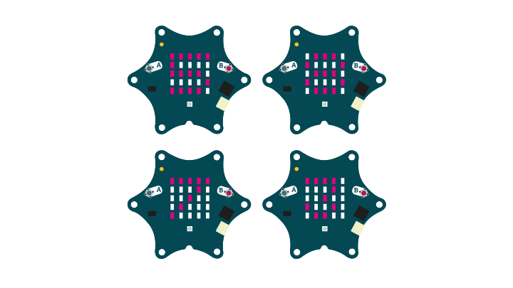
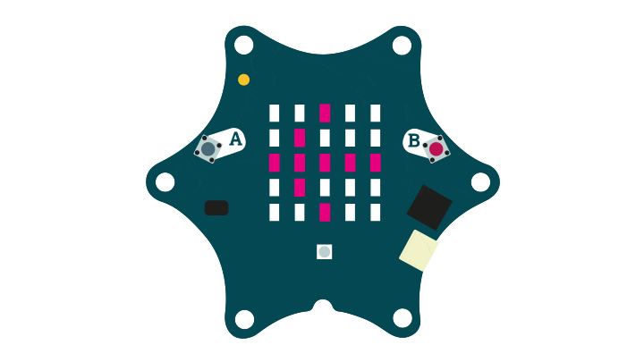
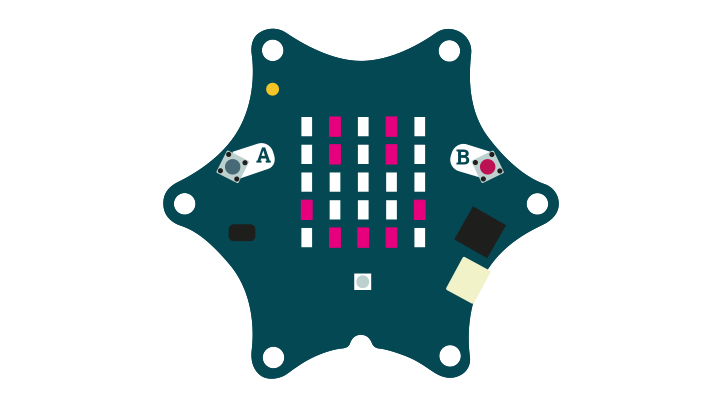
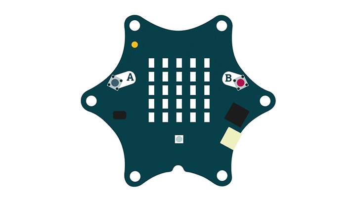
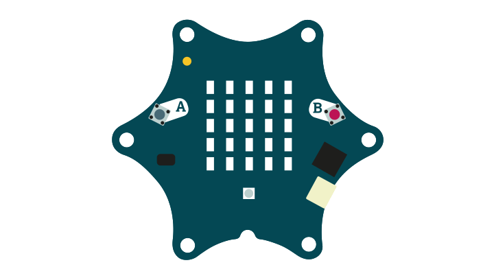
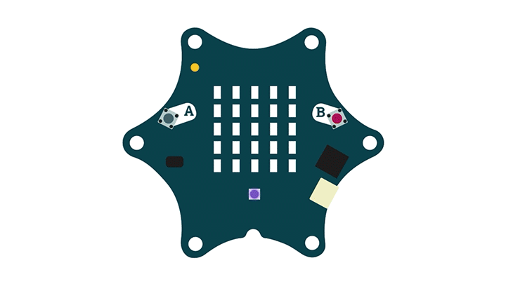
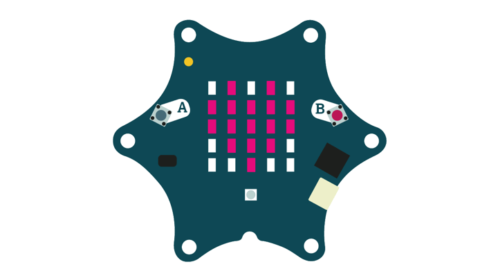
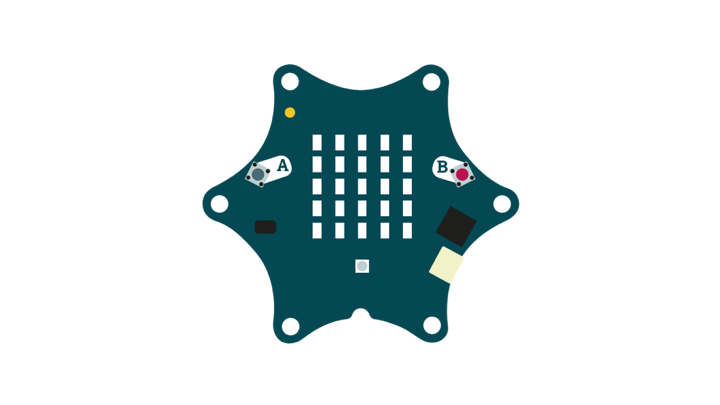
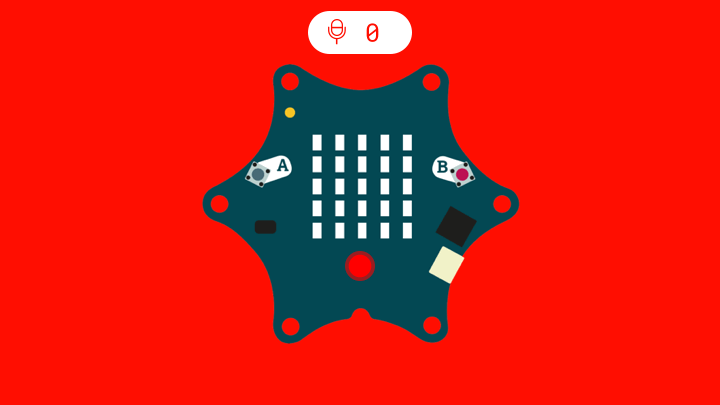
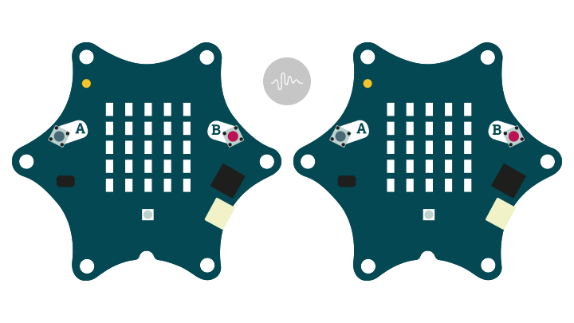

# {title}

## Ausgaben / Output

### LED-Matrix

Auf der LED-Matrix des Calliope mini befinden sich 5 x 5 = 25 rote LEDs, mit denen nicht nur Zahlen und Texte, sondern auch Bilder und sogar Animationen dargestellt werden. So ähnlich funktionieren auch größere Bildschirme, bei denen die Leuchtpunkte, auch als Pixel bezeichnet, nur deutlich verdichteter sind.

#### Text anzeigen

Es können einzelne Buchstaben oder auch ganze Wörter und Sätze angezeigt werden. In Open Roberta kann eingestellt werden, ob der Text als einzelne Zeichen angezeigt wird, oder durch den Bildschirm als Animation durchläuft. In MakeCode läuft der Text automatisch über die LED-Anzeige, wenn dieser länger als ein Buchstabe ist.

<Buttons 
    mind='./files/text/calliope_mini_string.sb3'
    makecode='./files/text/calliope_mini_string.hex'
    makecodeUrl='https://makecode.calliope.cc/_CiuafTRkW1M0'
    nepo='./files/text/calliope_mini_string.xml'
    />

#### Zahlen anzeigen

Es können einzelne Ziffern oder auch größere Zahlen mit Nachkommastellen angezeigt werden. In Open Roberta kann eingestellt werden, ob größere Zahlen als einzelne Ziffern angezeigt werden, oder durch den Bildschirm als Animation durchlaufen. In MakeCode laufen Zahlen, die mehr als eine Stelle haben, automatisch als Animation durch.

<Buttons 
    mind='./files/zahl/calliope_mini_number.sb3'
    makecode='./files/zahl/calliope_mini_number.hex'
    makecodeUrl='https://makecode.calliope.cc/_ep2KuJ1pyfs4'
    nepo='./files/zahl/calliope_mini_number.xml'
    />

#### Symbole anzeigen

Es können vordefinierten Symbole und Bildern ausgewählt und auf der LED-Matrix angezeigt werden.

<Buttons 
    mind='./files/symbol/calliope_mini_symbol.sb3'
    makecode='./files/symbol/calliope_mini_symbol.hex'
    makecodeUrl='https://makecode.calliope.cc/_EY2W8dgPg6eL'
    nepo='./files/symbol/calliope_mini_symbol.xml'
    />

#### Eigene Bilder anzeigen

Für eigene Symbole können die einzelnen Leuchtpunkte individuell an- oder ausgeschaltet werden.

<Buttons 
    mind='./files/grid/calliope_mini_grid.sb3'
    makecode='./files/grid/calliope_mini_grid.hex'
    makecodeUrl='https://makecode.calliope.cc/_M5xPRsREVWbx'
    nepo='./files/grid/calliope_mini_grid.xml'
    />

### RGB-LED

Die RGB-LED kann in den verschiedensten Farben leuchten. Genau genommen in 256^3 = 16,7 Millionen Farben, denn die unterschiedlichen Farben werden aus drei Primärfarbtönen additiv zusammen gemischt, die in der Programmierung einen Wertebereich von 0-255 annehmen. Die additive Farbmischung beruht auf dem Konzept, dass nahezu jede Farbe aus den drei Farben Rot, Grün und Blau zusammengesetzt werden kann. Schwarz wird dargestellt, wenn die Summe 0 ist, also alle LEDs aus geschaltet sind und Weiß, wenn alle LEDs maximal leuchten. Die Sekundärfarben Gelb, Cyan und Magenta werden entsprechend nur aus zwei Farben zusammen gemischt. So setzt sich z.B. Gelb nur aus Grün und Rot zusammen und hat den RGB-Wert (255, 255, 0).

#### Farben anzeigen

<Buttons 
    mind='./files//calliope_mini_.sb3'
    makecode='./files//calliope_mini_.hex'
    makecodeUrl=''
    nepo='./files//calliope_mini_.xml'
    />

### Lautsprecher

Der Calliope mini kann Musik und Töne mit seinem eingebauten Piezolautsprecher abspielen. Ein Piezolautsprecher beruht auf dem piezoelektrischen Effekt, der aus dem altgriechischen piezein abgeleitet ist, was so viel wie drücken oder pressen bedeutet. Wird an dem Material eine elektrische Spannung angelegt, verformt sich diese im Rhythmus der Frequenz. So kann ein Audiosignal aus verschiedenen Frequenzen in Schallwellen umgewandelt werden. Das gleiche Prinzip funktioniert auch umgekehrt als Mikrofon.

<Buttons 
    mind='./files//calliope_mini_.sb3'
    makecode='./files//calliope_mini_.hex'
    makecodeUrl=''
    nepo='./files//calliope_mini_.xml'
    />

## Eingaben / Input

### Taste - A, B, AB

Überall in unserem Leben finden wir Knöpfe/Tasten, die wir drücken müssen, um Aktionen und Funktionen auszulösen, z.B. eine PC-Tastatur, ein Spielcontroller oder die Knöpfe an einem Getränkeautomaten. Eine Taste funktioniert so ähnlich wie ein Schalter, nur dass dieser den Stromkreis so lange schließt, wie die Taste gedrückt wird. Der Calliope mini hat zwei Tasten: A und B. Gleichzeitig gedrückt, können sie auch eine dritte Eingabemöglichkeit ergeben: A + B

<Buttons 
    mind='./files//calliope_mini_.sb3'
    makecode='./files//calliope_mini_.hex'
    makecodeUrl=''
    nepo='./files//calliope_mini_.xml'
    />

### Touchpins - 0, 1, 2, 3

Die Touchpins sind I/O Eingabe/Ausgabe-Pins, die sich gut dafür eignen, mit den Fingern einen Schaltkreis zu schließen oder Krokodilklemmen anzulegen. An dem 6-eckigen Calliope mini gibt es insgesamt vier Touchpins, die von 0 bis 3 durchnummeriert sind sowie einen Plus- und einen Minuspol. Sowohl die Pins als auch der Pluspol speisen alle eine Spannung von 3,3 Volt. Es ist wichtig, den Minuspol zu berühren, um ein "drücken der Pins" auszulösen. Alle Pins sind digital. Die Pins 1 und 2 sind außerdem analog, womit sich z.B. Servomotoren ansteuern oder die analogen Werte eines Potentiometers ausgeben lassen können.

<Buttons 
    mind='./files//calliope_mini_.sb3'
    makecode='./files//calliope_mini_.hex'
    makecodeUrl=''
    nepo='./files//calliope_mini_.xml'
    />

## Sensoren

### Bewegungs- und Lagesensor

Der Bewegungs- und Lagesensor (Bosch BMX055) enthält einen Beschleunigungssensor, einen Kreiselsensor und ein Magnetometer (Kompass). Dadurch kann der Calliope mini zum Beispiel messen, in welche Lage er sich befindet und in welche Richtung mit welcher Stärke er bewegt wird.

#### Gesten

Die verschiedenen Gesten mit dem der Calliope bewegt, geschüttelt usw. wird, können als Events in der jeweiligen Programmierumgebung abgerufen werden.

<Buttons 
    mind='./files//calliope_mini_.sb3'
    makecode='./files//calliope_mini_.hex'
    makecodeUrl=''
    nepo='./files//calliope_mini_.xml'
    />

#### Beschleunigungssensor

Es kann eine genaue Geschwindigkeitszu- oder abnahme mithilfe des Beschleunigungssensor (Accelerometer) gemessen werden. Die Werte werden in ein Tausendstel der Erdbeschleunigung (g-Kraft) angegeben und können für die 3 Achsen x, y und z, sowie der gesamten Stärke abgerufen werden - das entspricht der Summe der G-Kraft aller Achsen geteilt durch die Anzahl der Achsen (3). Bedenke, dass die Erdanziehung immer als Beschleunigungs bzw. Anziehungskraft auf uns wirkt und auch vom Accelerometer erfasst wird.

<Buttons 
    mind='./files//calliope_mini_.sb3'
    makecode='./files//calliope_mini_.hex'
    makecodeUrl=''
    nepo='./files//calliope_mini_.xml'
    />

#### Kreiselsensor

Mit dem Kreiselsensor oder auch Gyroskop, kann die Lage beziehungsweise die Rotation der zwei Achsen x und y in Grad (°) gemessen werden. Eine Drehung der X-Achse bezeichnet man als Nicken und eine Drehung der Y-Achse als Rollen. Legt man den Calliope mini auf einen Tisch und zieht eine Linie zwischen Pin 0 und Pin 3, dann ist dies die X-Achse. Zwischen USB-Port und der gegenüberliegenden Kante zwischen Pin 1 und 2, liegt die Y-Achse.

<Buttons 
    mind='./files//calliope_mini_.sb3'
    makecode='./files//calliope_mini_.hex'
    makecodeUrl=''
    nepo='./files//calliope_mini_.xml'
    />

#### Kompass

Das integrierte Magnetometer kann die Magnetkraft des Erdmagnetfelds messen und so als Kompass dienen. Die Himmelsrichtung wird in Grad (°) ausgegeben. Der Norden liegt bei 0°, der Osten bei 90°, der Süden bei 180° und der Westen bei 270°.

<Buttons 
    mind='./files//calliope_mini_.sb3'
    makecode='./files//calliope_mini_.hex'
    makecodeUrl=''
    nepo='./files//calliope_mini_.xml'
    />

### Lichtsensor

Leuchtdioden (LEDs) können nicht nur Licht abstrahlen, sondern auch das Licht als Fotodioden einfangen. Die LED-Matrix beim Calliope mini ist gleichzeitig auch der Lichtsensor, mit dem das Umgebungslicht gemessen werden kann. Dadurch können Helligkeitsunterschiede von dem Calliope mini zwischen drinnen und draußen oder Tag und Nacht erkannt werden. Die Helligkeit wird im jeweiligen Editor in einem unterschiedlichen Wertebereich ausgegeben. In Open Roberta in Prozent 0 - 100 und in MakeCode in 8-Bit von 0 - 255.

<Buttons 
    mind='./files//calliope_mini_.sb3'
    makecode='./files//calliope_mini_.hex'
    makecodeUrl=''
    nepo='./files//calliope_mini_.xml'
    />

### Temperatursensor

Im Prozessor (Nordic nRF51822) ist ein eingebauter Temperatursensor integriert, mit dem der Calliope mini die ungefähre Umgebungstemperatur messen kann. Die Temperatur wird in Grad Celsius (°C) ausgegeben.

<Buttons 
    mind='./files//calliope_mini_.sb3'
    makecode='./files//calliope_mini_.hex'
    makecodeUrl=''
    nepo='./files//calliope_mini_.xml'
    />

### Mikrofon / Lautstärkesensor

Mit dem MEMS-Mikrofon kann die Lautstärke gemessen werden. Sie reicht von 0 - 100 Prozent.

<Buttons 
    mind='./files//calliope_mini_.sb3'
    makecode='./files//calliope_mini_.hex'
    makecodeUrl=''
    nepo='./files//calliope_mini_.xml'
    />

### Funk

Der Calliope mini besitzt eine kleine Antenne, mit der elektromagnetische Wellen abgestrahlt und empfangen werden können. Dieser unterstützt zwei kabellose Übertragungsdienste: den Funk, womit Nachrichten zwischen verschiedenen Calliope mini übermittelt werden und Bluetooth, mit dem der Calliope mini mit anderen Geräten wie z.B. Handys und Tablets gekoppelt werden kann, um Daten zu übermitteln oder selbst programmiert zu werden. Es kann nur ein Dienst zur gleichen Zeit aktiviert sein. Es kann über verschiedene Funkgruppen/-kanäle, die in der Programmierung festgelegt werden, gefunkt werden. Nur Calliope mini der gleichen Funkgruppe können untereinander kommunizieren.

<Buttons 
    mind='./files//calliope_mini_.sb3'
    makecode='./files//calliope_mini_.hex'
    makecodeUrl=''
    nepo='./files//calliope_mini_.xml'
    />

#### Werte senden

Es können Zahlen, Texte und logische Werte (Open Roberta) gesendet werden. In MakeCode kann außerdem ein Wertepaar versendet werden, welches sich aus einem Namen und einer Zahl zusammensetzt.

<Buttons 
    mind='./files//calliope_mini_.sb3'
    makecode='./files//calliope_mini_.hex'
    makecodeUrl=''
    nepo='./files//calliope_mini_.xml'
    />

#### Werte empfangen

Die Werte können empfangen und abgerufen werden, wenn sich die Calliope mini in der gleichen Funkgruppe/-Kanal befinden.

<Buttons 
    mind='./files//calliope_mini_.sb3'
    makecode='./files//calliope_mini_.hex'
    makecodeUrl=''
    nepo='./files//calliope_mini_.xml'
    />

## Befehle und Funktionen

### Sequenz

Eine Sequenz ist die einfachste Form einer Anweisung. Das Programm folgt genau deinen Anweisungen von oben nach unten ab.

#### Start

Die Startfunktion ist in jedem Programm enthalten und unumgänglich, denn sie definiert, was einmalig beim Programmstart ausgeführt werden soll und ist so etwas wie der Eingang und Zugang zu dem Programm. Wie bei einem Spiel oder einer Veranstaltung im realen Leben werden auch die Regeln und Bedingungen für den Programmablauf vorab in Variablen definiert.

<Buttons 
    mind='./files//calliope_mini_.sb3'
    makecode='./files//calliope_mini_.hex'
    makecodeUrl=''
    nepo='./files//calliope_mini_.xml'
    />

#### Pause

Beim Programmieren sind Pausen wichtig, damit der Computer hier kurz verweilt. Das kann wichtig sein, damit zum Beispiel eine Farbanzeige länger zu sehen ist, bevor das Programm weitergelesen und ausgeführt wird. Die Pause setzt allerdings auch das gesamte Programm für diesen Zeitraum aus. Wenn weitere Aufgaben in diesem Zeitraum erledigt werden sollen, wie z.B. ein Ton soll abgespielt werden, während die LED in einem Intervall blinkt, dann empfiehlt es sich, die Laufzeit zu verwenden.

<Buttons 
    mind='./files//calliope_mini_.sb3'
    makecode='./files//calliope_mini_.hex'
    makecodeUrl=''
    nepo='./files//calliope_mini_.xml'
    />

### Schleifen

In der Programmierung ist eine Schleife eine Kontrollstruktur. Sie wiederholt Anweisungen unendlich lange oder so lange bis eine Abbruchbedingung erfüllt ist.

#### Dauerhaft / wiederhole unendlich oft

Die „unendlich“-Schleife sorgt dafür, dass eine Anweisung immer wieder ausgeführt wird. Das ist in der Programmierung wichtig, damit bestimmte Abschnitte des Codes dauerhaft ausgeführt werden. Für die Programmierung von fortlaufenden Programmen ohne Abbruchbedingung, wie Spielen, Interaktionsprojekten oder Sensormessungen ist dieser Block meistens unumgänglich.

<Buttons 
    mind='./files//calliope_mini_.sb3'
    makecode='./files//calliope_mini_.hex'
    makecodeUrl=''
    nepo='./files//calliope_mini_.xml'
    />

#### Wiederhole x Mal

Die Anweisungen innerhalb der Schleife werden so oft ausgeführt, wie angegeben.

<Buttons 
    mind='./files//calliope_mini_.sb3'
    makecode='./files//calliope_mini_.hex'
    makecodeUrl=''
    nepo='./files//calliope_mini_.xml'
    />

#### Wiederhole bis / während

Die "Wiederhole bis"-Schleife führt eine Anweisung so lange aus, bis eine Abbruchbedingung erfüllt ist. Eine Abbruchbedingung muss ein Wahrheitswert oder eine logische Aussage sein, die wahr oder falsch sein kann. Ein Beispiel wäre es, die LED so lange blinken zu lassen, bis die Temperatur unter 10 Grad sinkt. "Während" ist das Pendant zu "Wiederhole so lange". Es wird der Code ausgeführt, so lange die Bedingung wahr ist. "Wiederhole bis" funktioniert umgekehrt. Der Code wird immer wieder ausgeführt, während eine Bedingung noch falsch, bzw. nicht eingetreten ist und abgebrochen, wenn sie wahr ist.

<Buttons 
    mind='./files//calliope_mini_.sb3'
    makecode='./files//calliope_mini_.hex'
    makecodeUrl=''
    nepo='./files//calliope_mini_.xml'
    />

#### Wiederhole für Index von bis

Diese Schleife zählt einen Index für einen definierten Wertebereich hoch und stellt diesen als Variable lokal innerhalb der Schleife bereit. Die Schleife startet bei dem Startwert und bricht beim Erreichen des höchsten Wertes ab. Sie eignet sich z.B. dafür, um einen Countdown mit dem Wert des Index hochzuzählen oder um Werte aus einer Liste abzurufen.

<Buttons 
    mind='./files//calliope_mini_.sb3'
    makecode='./files//calliope_mini_.hex'
    makecodeUrl=''
    nepo='./files//calliope_mini_.xml'
    />

### Logik

Mit den Logikbausteinen wird ein Programmablauf gesteuert und kann bei unterschiedlicher Eingabe zu unterschiedlichen Ausgaben und Ergebnissen führen. Die Logik basiert auf der booleschen Algebra, bei der zwei Zustände/Wahrheitswerte wahr und falsch oder 1 und 0 verknüpft werden und zu verschiedenen Ausgaben führen. Solche logischen Verknüpfungen bilden die Grundlage für die Transistorenschaltungen in den Prozessoren und der digitalen Elektronik.

#### Logische/boolesche Operatoren

Es gibt logische Operatoren wie Negation (nicht), Konjunktion (und), Disjunktion (oder) und Vergleiche wie größer (ᐳ), kleiner (ᐸ) und gleich (=). Mit den logischen Operatoren können Wahrheitswerte wie wahr und falsch zurückgegeben werden.

<Buttons 
    mind='./files//calliope_mini_.sb3'
    makecode='./files//calliope_mini_.hex'
    makecodeUrl=''
    nepo='./files//calliope_mini_.xml'
    />

#### Bedingte Anweisung

Die **bedingte Anweisung**, als "Wenn, dann"- oder "Wenn, mache"-Block bekannt, führt einen Abschnitt nur aus, wenn eine Bedingung erfüllt wurde. Ein Beispiel wäre es, die RGB-LED nur anzuschalten, wenn die Temperatur über 20 Grad steigt. Die LED bleibt rot, selbst wenn die Temperatur wieder unter 20 Grad sinkt. Eine **Verzweigung** stellt mit "ansonsten" einen alternativen Programmabschnitt bereit, der ausgeführt wird, wenn die Bedingung nicht eintritt oder falsch ist. In dem Beispiel der LED könnte man diese wieder ausschalten, wenn es unter 20 Grad ist.

#### Wenn, dann / ansonsten, wenn / ansonsten

Die zweite Form einer Mehrfachverzweigung kann sich als Baumstruktur vorgestellt werden. Es wird die erste Bedingung geprüft. Ist diese wahr, geht es in den nächsten Zweig mit der nächsten Bedingung. Ist diese falsch, wird die gesamte Verzweigung abgebrochen und die nächsten Bedingungen werden nicht mehr geprüft. Die Reihenfolge ist hier entscheidend. In den Programmiereditoren können mehrere Bedingungen mit dem Klicken auf das "+" ergänzt werden.

<Buttons 
    mind='./files//calliope_mini_.sb3'
    makecode='./files//calliope_mini_.hex'
    makecodeUrl=''
    nepo='./files//calliope_mini_.xml'
    />

### Mathematik

Ein Prozessor verarbeitet zwar nur zwei Zustände 0 und 1 / an und aus, aber mithilfe einer auf Transistorenschaltungen basierenden arithmetisch-logischen Einheit (ALU) werden Rechenoperationen im Handumdrehen ausgeführt. Somit kann der Calliope mini auch als Taschenrechner im Dezimalsystem verwendet werden und komplexe mathematische und logische Aufgaben lösen.

#### Arithmetische Operatoren

Mit arithmetische Operatoren wie Additon (+), Substraktion (-), Multiplikation (*) und Division (/) werden Zahlen zurückgegeben, die negativ oder positiv sein können und Nachkommastellen besitzen.

<Buttons 
    mind='./files//calliope_mini_.sb3'
    makecode='./files//calliope_mini_.hex'
    makecodeUrl=''
    nepo='./files//calliope_mini_.xml'
    />

#### Modulo / Rest aus Division

Der Modulooperator (%) gibt den Rest einer Division aus zwei Zahlen zurück und kann hilfreich sein, um gerade Zahlen zu finden (i%2), ein wiederholendes Muster aus Zahlen zu generieren oder z.B. die X-Werte der LEDs in dem 5x5 Raster zu erhalten (i%5).

<Buttons 
    mind='./files//calliope_mini_.sb3'
    makecode='./files//calliope_mini_.hex'
    makecodeUrl=''
    nepo='./files//calliope_mini_.xml'
    />

#### Zufall

Eine zufällige Zahl wird innerhalb eines definierten Zahlenbereichs gewählt. Der Zufall spielt in der Programmierung eine wichtige Rolle in Spielen, aber auch in der Verschlüsselung von Daten. Wenn im realen Leben ein Würfel geworfen wurde, dann ist das Ergebnis aufgrund von sehr vielen physikalischen Einflüssen kaum vorherzusagen, wobei es in der Theorie möglich wäre. Da Computer vorhersagbar (deterministisch) arbeiten, also nach Eingabe auch immer das gewünschte Ergebnis entsteht, wird der Zufall in manchen Fällen durch die Eingabe von physikalischen, willkürlichen Daten, wie das Tastendrücken, Umgebungsgeräusche, Lage etc. generiert.

<Buttons 
    mind='./files//calliope_mini_.sb3'
    makecode='./files//calliope_mini_.hex'
    makecodeUrl=''
    nepo='./files//calliope_mini_.xml'
    />

### Variablen

Variablen sind in der Programmierung eine Art „Behälter“, in dem ein Programm einen Datenwert, wie z.B. eine Zahl, eine Zeichenkette oder ein Symbol, ablegen kann. Eine Variable kann abgefragt und verändert werden. Z.B. wird der Punktestand in einem Spiel in eine Variable geschrieben und kann somit ständig abgefragt und verändert werden.

<Buttons 
    mind='./files//calliope_mini_.sb3'
    makecode='./files//calliope_mini_.hex'
    makecodeUrl=''
    nepo='./files//calliope_mini_.xml'
    />

#### Übungen und Projekte

<Button text='Klickzähler' link='https://calliope.cc/schulen/unterrichtsmaterial/1-10-klickzaehler' />
<Button text='Fahrradlicht' link='https://calliope.cc/schulen/unterrichtsmaterial/4-8-fahrradlicht' />

### Listen

Listen sind ein Datentyp, der mehrere Zahlen, Texte, Wahrheitswerte oder sogar auch Bilder beinhalten kann. Die Werte einer Liste können mithilfe von Schleifen als Stapel verarbeitet und abgerufen werden.

#### Werte hinzufügen

Werte können an eine Liste am Ende, am Anfang oder an der Position des Index hinzugefügt oder ersetzt werden.

<Buttons 
    mind='./files//calliope_mini_.sb3'
    makecode='./files//calliope_mini_.hex'
    makecodeUrl=''
    nepo='./files//calliope_mini_.xml'
    />

#### Werte abrufen

Alle Werte einer Liste können über den Index mit einer Schleife abgerufen und ausgelesen werden.

<Buttons 
    mind='./files//calliope_mini_.sb3'
    makecode='./files//calliope_mini_.hex'
    makecodeUrl=''
    nepo='./files//calliope_mini_.xml'
    />

### Funktionen

Funktionen sind so etwas wie selbst definierte Programmbausteine, die recycelt und wiederverwertet werden können und womit ein komplexeres Programm in Unterprogramme strukturiert werden kann. Sie können sich auch als eine Maschine vorgestellt werden, die, wie das Wort schon sagt, eine ganz bestimmte Funktion erfüllt.

#### Funktion

Eine einfache Funktion lagert den Programmcode nur an einen anderen Ort aus und dieser kann so oft abgerufen werden, wie die Funktion aufgerufen wird (z.B. in einer Schleife).

<Buttons 
    mind='./files//calliope_mini_.sb3'
    makecode='./files//calliope_mini_.hex'
    makecodeUrl=''
    nepo='./files//calliope_mini_.xml'
    />

#### Funktion mit Eingabeparameter

Eine Funktion mit Eingabeparameter ist flexibler, weil sie verschiedene Eingabewerte lokal verarbeiten kann und einen individuelle Ausgabe generiert. Z.B. kann eine Funktion für das blinkende Herz geschrieben werden und die Anzahl als Parameter festgelegt werden, wie oft die LED blinken soll.

<Buttons 
    mind='./files//calliope_mini_.sb3'
    makecode='./files//calliope_mini_.hex'
    makecodeUrl=''
    nepo='./files//calliope_mini_.xml'
    />

#### Funktion mit Rückgabewert

Eine Funktion mit Rückgabewert kann sich als eine Maschine vorgestellt werden, die ein Produkt oder Zwischenprodukt herstellt. Der Rückgabewert ist ein Datentyp, wie eine Zahl, ein logischer Wert und kann erneut als Eingabe fungieren.

<Buttons 
    mind='./files//calliope_mini_.sb3'
    makecode='./files//calliope_mini_.hex'
    makecodeUrl=''
    nepo='./files//calliope_mini_.xml'
    />
